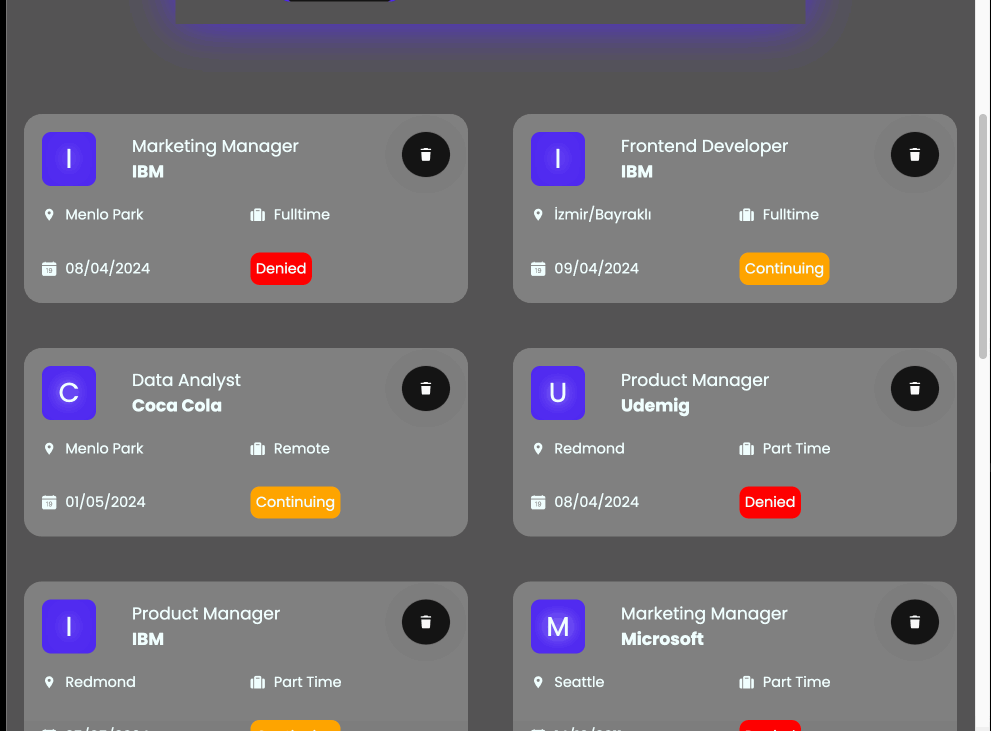

<h1> Job App Toolkit </h1>

The Job App project we made was developed using Redux Toolkit. Easy and fast installation was achieved with ConfigureStore.
Thanks to CreateSlice, action and reducer definitions have been written in simple and compact code. Components have access to the state with selectors.

<h2>Screenshot</h2>

# Library

- react-router-dom
- axios
- json-server
- react-toastify
- react-redux
- @reduxjs/toolkit
- uuid
- react-icons
- sass
